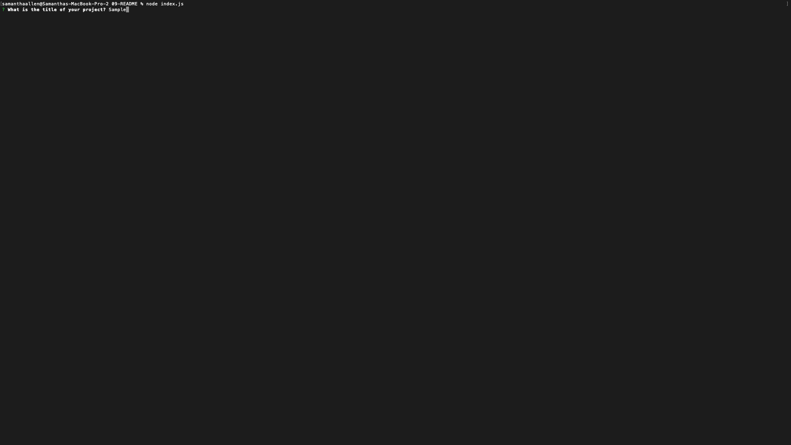
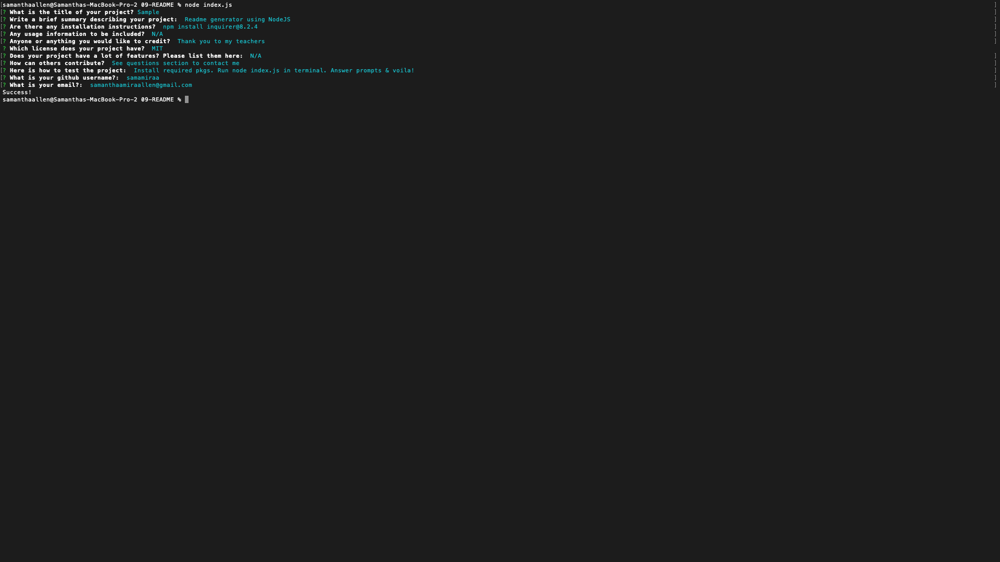

# 09-README

## Description

My motivation to complete this project was to make sure I do not fall too far behind in class. I also wanted to revisit node.js since our lessons were before christmas break. I built this because this is my first project for the back end side of development. I am a hands on learner, so this helps me understand. I learned that things are not as complicated as they seem and you should never be afraid to ask for help.

## Table of Contents 

- [Installation](#installation)
- [Usage](#usage)
- [Credits](#credits)
- [License](#license)

## Installation

NPM Install inquirer@8.2.4 
https://www.npmjs.com/package/inquirer/v/8.2.4

## Usage

After installing the inquirer package, navigate to the folder in your terminal/git bash that the index.js file is in. In your terminal enter in "node index.js" 
 
 
 
The first prompt should appear asking what the title of the project is 
 
 
After you enter in the title, the next prompt will ask you to enter in a brief summary 
 
 
After you enter in the summary, the next prompt will ask you to enter in any installation instructions 
 
 
After you enter in the installation instructionse, the next prompt will ask you to enter in any usage information 
 
 
After you enter in the usage information, the next prompt will ask you to enter in any credits 
 
 
After you enter in the credits, the next prompt will ask you to choose a license. You can toggle with the arrow keys and hit enter to select 
 
 
After you choose the license, the next prompt will ask you to enter in any features 
 
 
After you enter in the features, the next prompt will ask you to enter in any contributions 
 
 
After you enter in the contributions, the next prompt will ask you to enter in how to test the project 
 
 
After you enter in the testing information, the next prompt will ask you to enter in your github username 
 
 
After you enter in your github username, the next prompt will ask you to enter in your email 
 
 
After you enter in your email, the next prompt will either log 'Success!' indicating the readme was generated or it will give an error. 
 
 
Next you will see that in your folder a readme is generated with the information you entered in the appropriate spots. 
 

## Credits

I went through all the node class activities again, but thank you to my teachers assistant Daniel for clarifying a few things regarding this assignment.

https://www.geeksforgeeks.org/node-js-fs-writefile-method/
https://stackoverflow.com/questions/40046764/is-it-possible-to-have-a-comment-inside-a-es6-template-string#:~:text=Yes.&text=Note%20that%20you%20have%20to,anywhere%20outside%20of%20the%20comment.
https://github.com/styled-components/stylelint-processor-styled-components/issues/46
https://www.w3schools.com/nodejs/nodejs_modules.asp
https://developer.mozilla.org/en-US/docs/Web/JavaScript/Reference/Global_Objects/String/split

## License

The MIT License is short and to the point. It lets people do almost anything they want with your project, like making and distributing closed source versions.

## Badges

N/A

## Features

N/A

## How to Contribute

N/A

## Tests

Create your own README! Install the inquirer@8.2.4. In your terminal/git bash, run node index.js. Answer prompts & voila, a proffessional readme is created! See usage for screenshots & please refer to the video if it is still unclear!